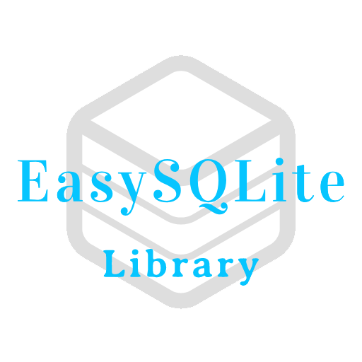

# EasySQLite
<p align="center">
  
</p>
EasySQLite is an android library SQLite database. It is very simple and easy to use for your database needs in an android project. 

# Table of Contents
  1. [Gradle Dependency](https://github.com/ShahabGT/EasySQLite#gradle-dependency)<br>
    2. [Create a New Database](https://github.com/ShahabGT/EasySQLite#create-a-new-database)<br>
	 3. [Create a New Table](https://github.com/ShahabGT/EasySQLite#create-a-new-table)<br>
	  4. [Insert Command](https://github.com/ShahabGT/EasySQLite#insert-command)<br>
	   5. [Update Command](https://github.com/ShahabGT/EasySQLite#update-command)<br>
	    6. [Clear a Table](https://github.com/ShahabGT/EasySQLite#clear-a-table)<br>
		 7. [Delete Command](https://github.com/ShahabGT/EasySQLite#delete-command)<br>
		  8. [Select Command](https://github.com/ShahabGT/EasySQLite#select-command)<br>
		   9. [SQL Command](https://github.com/ShahabGT/EasySQLite#sql-command)<br>
		    10. [Developed By](https://github.com/ShahabGT/EasySQLite#developed-by)<br>
			 11. [License](https://github.com/ShahabGT/EasySQLite#license)<br>


# Gradle Dependency
Step 1. Add the JitPack repository to your build file <br>
Add it in your root build.gradle (project level) at the end of repositories:
```
	allprojects {
		repositories {
			...
			maven { url 'https://jitpack.io' }
		}
	}
```
Step 2. Add the dependency<br>
Add it in your dependencies section of build.gradle (app level):
```
	dependencies {
	        implementation 'com.github.ShahabGT:EasySQLite:1.0.0'
	}
```
# Create a New Database
With this library you can create as many databases as you what to your project. Just use the codes below:
```
EasyDatabase easyDatabase= new EasyDatabase(`Activity`,`Database Name`,`Database Version`);
```
Activity= just put your activity in here<br>
Database Name= give your database a name, it uses String values.<br>
Database Version = give your database a version, it uses Int values.<br>
 
# Create a New Table
With this library you can create multiple tables in multiple databases, below you can learn how to make one:
```
        easyDatabase.createTable(`Table Name`)
                .addColumn(`Column Name`,`Data Type `,`First Constraint`,` Second Constraint`)
				.
				.
				.
                .Build();
```
Table Name= just give a name for you table, it uses String values.<br>
You can use .addColumn method indefinitely.<br>
Column Name = name of a column in the table, uses String<br>
Data Type = type of your column, uses String, you can choose from:<br>
```
    DataTypes.BIGINT,
    DataTypes.BINARY,
    DataTypes.BLOB,
    DataTypes.BLOB_TEXT,
    DataTypes.BOOL,
    DataTypes.BOOLEAN,
    DataTypes.CHAR,
    DataTypes.CLOB,
    DataTypes.CURRENCY,
    DataTypes.DATE,
    DataTypes.DATETEXT,
    DataTypes.DATETIME,
    DataTypes.DEC,
    DataTypes.DECIMAL,
    DataTypes.DOUBLE,
    DataTypes.DOUBLE_PRECISION,
    DataTypes.FLOAT,
    DataTypes.GRAPHIC,
    DataTypes.GUID,
    DataTypes.IMAGE,
    DataTypes.INT,
    DataTypes.INT64,
    DataTypes.INTEGER,
    DataTypes.LARGEINT,
    DataTypes.MEMO,
    DataTypes.MONEY,
    DataTypes.NCHAR,
    DataTypes.NTEXT,
    DataTypes.NUMBER,
    DataTypes.NUMERIC,
    DataTypes.NVARCHAR,
    DataTypes.NVARCHAR2,
    DataTypes.PHOTO,
    DataTypes.PICTURE,
    DataTypes.RAW,
    DataTypes.REAL,
    DataTypes.SMALLINT,
    DataTypes.SMALLMONEY,
    DataTypes.TEXT,
    DataTypes.TIME,
    DataTypes.TIMESTAMP,
    DataTypes.TINYINT,
    DataTypes.UNIQUEIDENTIFIER,
    DataTypes.VARBINARY,
    DataTypes.VARCHAR,
    DataTypes.VARCHAR2,
    DataTypes.WORD
```
For the First and Second Constraint you can use of the bellow: <br>
```
    Constraints.NOT_NULL,
    Constraints.UNIQUE,
    Constraints.PRIMARY,
    Constraints.AUTO_INCREMENT,
    Constraints.CHECK,
    Constraints.DEFAULT
```
If your First Constraint is CHECK or DEFAULT, you Second Constraint must be the value for check or the default value. In addition, if you do not want to use Constraints just put "" for both of them<br>
Example:
```
            easyDatabase.createTable("Messages")
						.addColumn("Id",DataTypes.INT, Constraints.PRIMARY_KEY,Constraints.AUTO_INCREMENT)
						.addColumn("Message",DataTypes.TEXT,DataTypes.NOT_NULL,"")
						.addColumn("Sender",DataTypes.TEXT,"","")
						.addColumn("Date",DataTypes.TIMESTAMP,Constraints.NOT_NULL,"")
						.Build();
```
# Insert Command
Use the code below to insert data into a table
```
easyDatabase.InsertIntoTable(`Table Name`,`Values`);
```
Table Name= just put the name of the table you want to insert data into, it uses String,<br>
Valuse= needs HashMap<String,String> for values , the first String describes the name of the column and the second one the data we want to put in it. <br>
```
        HashMap<String,String> values = new HashMap<>();
        values.put("Message","Hello World!");
        values.put("Sender","Shahab Azimi");
        easyDatabase.InsertIntoTable("Messages",values);
```
# Update Command
If you want to update an existing table with new values and clauses use the code below:
```
easyDatabase.UpdateTable(`Table Name`,`New Values`,`WhereClauses`);
```
Table Name= again the name of the table you want to update, Uses String for value<br>
New Values= needs HashMap<String,String>, the first String is for column name and the second one is for the value.<br>
WhereClauses = needs HashMap<String,String>, the first String is the where clause and the second String is for where args.<br>
Example (we want to put new data in Message column where Sender is Shahab Azimi in Messages table):
```
HashMap<String,String> newvalues = new HashMap<>();
        newvalues.put("Message","Android Library!");
        HashMap<String,String> whereclause = new HashMap<>();
        whereclause.put("Sender","Shahab Azimi");
        easyDatabase.UpdateTable("Messages", newvalues, whereclause);
```
# Clear a Table
To completely clear all the data from a table use the code below:
```
easyDatabase.ClearTable(`Table Name`);
```
# Delete Command
With this library you can delete data from a table with one where clause of multiple where clauses.<br>
With one where clause:
```
easyDatabase.DeleteFromTable(`Table Name`,`WhereClause`,`WhereArg`);
```
Do not use : or = at the end of your whereClause.<br>
All of the input values use String.<br>
Example:
```
easyDatabase.DeleteFromTable("Messages","Sender","Shahab Azimi");
```
With multiple where clauses:
```
easyDatabase.DeleteFromTable(`Table Name`,`WhereClause`);

```
For multi clause Delete Commant use HashMap<String,String> for whereClause. Look at the example below:
```
HashMap<String,String> wherecause = new HashMap<>();
        wherecause.put("Sender","Shahab Azimi");
        wherecause.put("Id","1");
easyDatabase.DeleteFromTable("Messages",wherecause);
```
# Select Command
You can select all the columns form a table with code below, it will return a Cursor object if the select command was successful and NULL if there are no data to return.
```
easyDatabase.GetAllDataFromTable(`Table Name`);
```
For selecting specific columns use code below:
```
easyDatabase.GetSpecificColumnsFromTable(`Table Name`,`Column Names`);
```
Column Names= use an array of Strings of column names<br>
Example:
```
easyDatabase.GetSpecificColumnsFromTable("Messages",new String[]{"Sender","Date"} );
```
# SQL Command
With this method you can execute SQL commands just use the method below and put your command in a String, It won’t return any values
```
easyDatabase.ExecuteSQL(`Sql Commad`);
```
But if you command returns a value and you need that value, use the method below. It will return a Cursor object.
```
easyDatabase.ExecuteRawSQL(`Sql Command`);
```
# Developed By

* Shahab Azimi
 * [shahabazimi.ir](http://shahabazimi.ir) - <azimishahab@gmail.com>

# License

    Copyright 2018 Shahab Azimi

    Licensed under the Apache License, Version 2.0 (the "License");
    you may not use this file except in compliance with the License.
    You may obtain a copy of the License at

       http://www.apache.org/licenses/LICENSE-2.0

    Unless required by applicable law or agreed to in writing, software
    distributed under the License is distributed on an "AS IS" BASIS,
    WITHOUT WARRANTIES OR CONDITIONS OF ANY KIND, either express or implied.
    See the License for the specific language governing permissions and
    limitations under the License.
